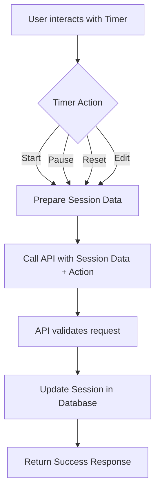
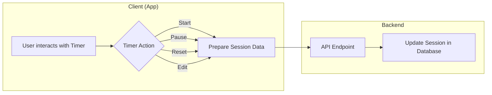
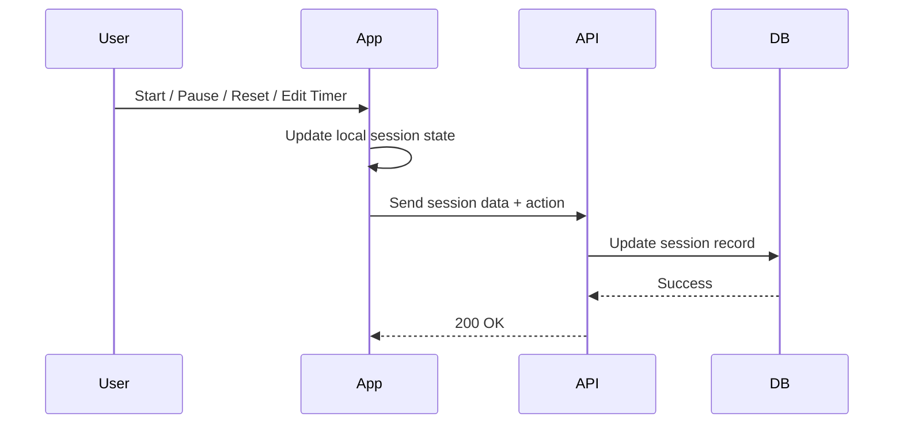
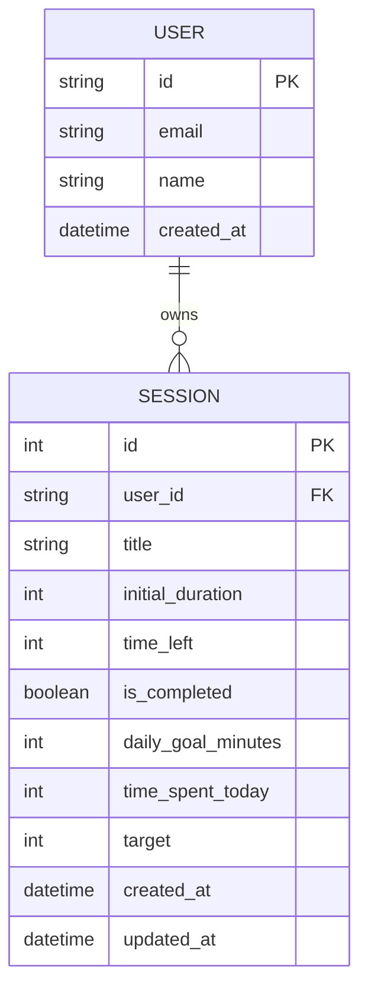

# Focus FLow

For multiple focus sessions and tracking productivity.

### Session
id: number
title: string
initialDuration: number
timeLeft: number
isCompleted: boolean
dailyGoalMinutes: number  // adjustable daily goal
timeSpentToday: number   // time spent on this task today
target: number // the target time at which this timer is supposed to complete

