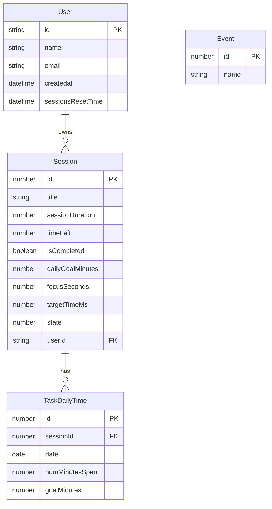

# Requirements
- Keep a client list of some kind (on every login the client gets added), then send the start, pause, etc. events to all the connected clients.
- Event based system
  - AddSession
  - Start
  - Stop
  - ResetSession
  - ResetAll
  - DeleteSession
  - EditSession
  - AutoResetTimeChange
- Compute analytics
  - Time spent per task per unit of time (day, week, month)
- Store data

## Schema

## Computing analytics
#### Requirements:
- Time spent on each goal by day
- 

### Notes
- targetTimeMs: milliseconds since epoch when this session is supposed to finish (only meaningful when the session is running)
- sessionDuration: sessionDuration when it starts
- dailyGoalMinutes: total daily goal for a particular Session
- focusSeconds: time spent today in focus on this session