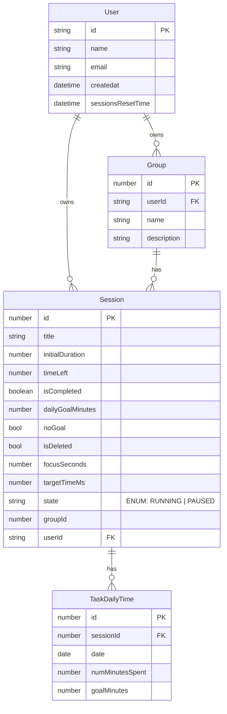

# Requirements
- Keep a client list of some kind (on every login the client gets added), then send the start, pause, etc. events to all the connected clients.
- Event based system
  - AddSession
  - Start
  - Stop
  - ResetSession
  - ResetAll
  - DeleteSession
  - EditSession
  - AutoResetTimeChange
- Compute analytics
  - Time spent per task per unit of time (day, week, month)
- Store data

## Schema

## Computing analytics
#### Requirements:
- Time spent on each goal by day
- 

### Notes
- targetTimeMs: milliseconds since epoch when this session is supposed to finish (only meaningful when the session is running)
- initialDuration: sessionDuration when it starts
- dailyGoalMinutes: total daily goal for a particular Session
- focusSeconds: time spent today in focus on this session

- Need to allow goalless sessions just for tracking time.
  - noGoal: if true means that this sessions has no goal. FocusSeconds to be null or zero in this case.
- session delete has to be a soft delete, because the task daily time will always exist.

## API Overview

### Auth
- All endpoints require Firebase ID token -> user needs to be logged in

### Sessions
GET /sessions
POST /sessions
  - Creates a new session
POST /sessions/{session_id}/actions/start
POST /sessions/{session_id}/actions/pause
POST /sessions/{session_id}/actions/reset
PATCH /sessions/{session_id}
  - Only allow editing the: dailyGoalMinutes and sessionDuration
DELETE /sessions/{session_id}

### Analytics
GET /analytics?period=daily
GET /analytics?period=weekly

## Real Time multi client updates
- On login, ping the backend
- On tab active or something, poll backend to fetch the latest sessions and state
- Client opens a websocket connection to the backend
- Backend maintains a list of all these clients for each user
- On each event (start, pause, edit), backend broadcasts to all the clients

### Passing b/w client and backend
EventType
- start
- pause
- edit
- deleteSession
- addSession

