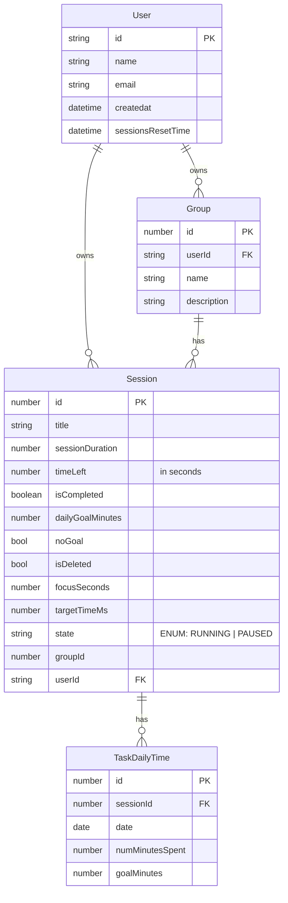
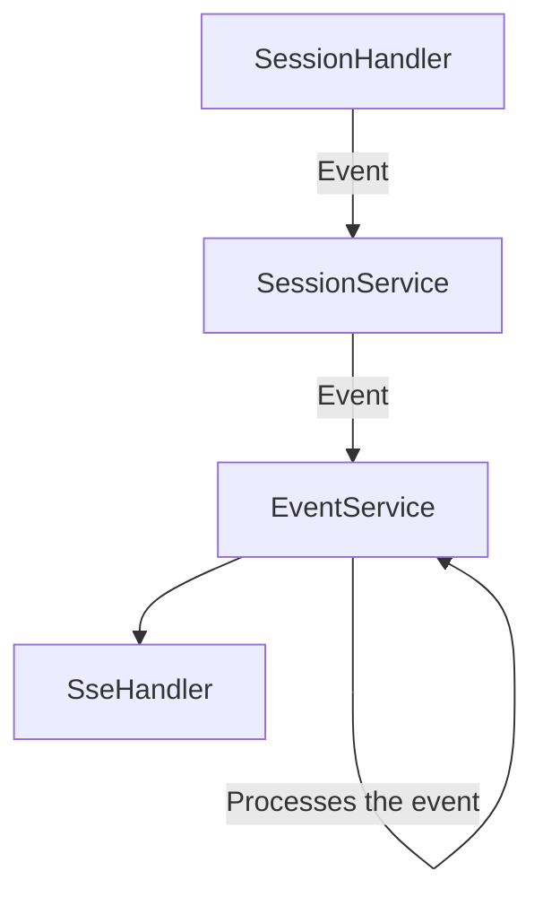

# Requirements
- Keep a client list of some kind (on every login the client gets added), then send the start, pause, etc. events to all the connected clients.
- Event based system
  - AddSession
  - Start
  - Stop
  - ResetSession
  - ResetAll
  - DeleteSession
  - EditSession
  - AutoResetTimeChange
- Compute analytics
  - Time spent per task per unit of time (day, week, month)
- Store data

# ToDo
- TimeLeft update should not be triggered by the frontend.
  - The backend should have this logic.
  - Schedule a event to fire at TargetTimeMs if the session in running state.
  - If in pause state, then do not fire this event
- Get all sessions request, if the user does not exist in DB then create it
- Frontend needs to send the sessions to backend if it finds nothing from backend.

## Schema

```mermaid
---
Title: DB Schema
---
erDiagram
Session {
    number id PK
    string title
    number sessionDuration
    number timeLeft "in seconds"
    boolean isCompleted
    number dailyGoalMinutes
    bool noGoal
    bool isDeleted
    number focusSeconds
    number targetTimeMs
    string state "ENUM: RUNNING | PAUSED"
    number groupId
    string userId FK
}

Group {
  number id PK
  string userId FK
  string name
  string description
}

User {
    string id PK
    string name
    string email
    datetime createdat
    datetime sessionsResetTime
}

TaskDailyTime {
    number id PK
    number sessionId FK
    date date
    number numMinutesSpent
    number goalMinutes
}

User ||--o{ Session : owns
Session ||--o{ TaskDailyTime : has
User ||--o{ Group : owns
Group ||--o{ Session : has

```

## Computing analytics
#### Requirements:
- Time spent on each goal by day
- 

### Notes
- targetTimeMs: milliseconds since epoch when this session is supposed to finish (only meaningful when the session is running)
- sessionDuration: sessionDuration when it starts
- dailyGoalMinutes: total daily goal for a particular Session
- focusSeconds: time spent today in focus on this session
- timeLeft: time left in current session in seconds

- Need to allow goalless sessions just for tracking time.
  - noGoal: if true means that this sessions has no goal. FocusSeconds to be null or zero in this case.
- session delete has to be a soft delete, because the task daily time will always exist.

## API Overview

### Auth
- All endpoints require Firebase ID token -> user needs to be logged in

### Sessions
GET /sessions
POST /sessions
  - Creates a new session
POST /sessions/{session_id}/actions/start
POST /sessions/{session_id}/actions/pause
POST /sessions/{session_id}/actions/reset
PATCH /sessions/{session_id}
  - Only allow editing the: dailyGoalMinutes and sessionDuration
DELETE /sessions/{session_id}

### Analytics
GET /analytics?period=daily
GET /analytics?period=weekly

## Real Time multi client updates
- On login, ping the backend
- On tab active or something, poll backend to fetch the latest sessions and state
- Client opens a websocket connection to the backend
- Backend maintains a list of all these clients for each user
- On each event (start, pause, edit), backend broadcasts to all the clients

### Passing b/w client and backend
EventType
- start
- pause
- edit
- deleteSession
- addSession

## EventService
Use SSE instead of WebSocket.
All the events from client to server will be through http requests.

```mermaid
flowchart TD
  SessionHandler --Event--> SessionService
  SessionService --Event--> EventService
  EventService --Processes the event--> EventService
  EventService --> SseHandler
```

## Archive
- Where should the daily progress be tracked? -> It is derived (sum of individual progress). So it shouldn't be tracked separately?
  - But when the reset progress event comes in, then what?
  - Reset the focus seconds in that case