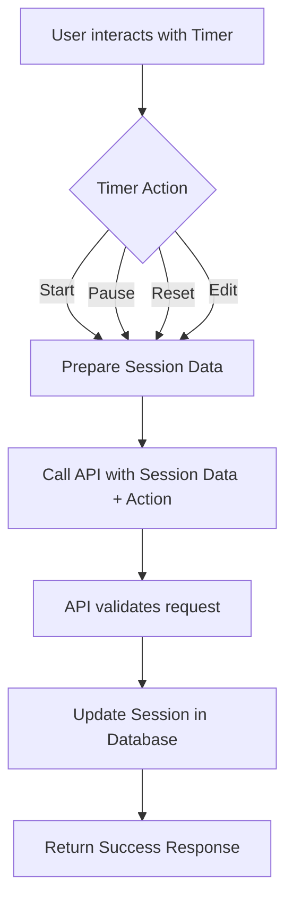
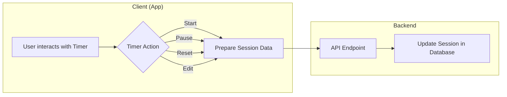
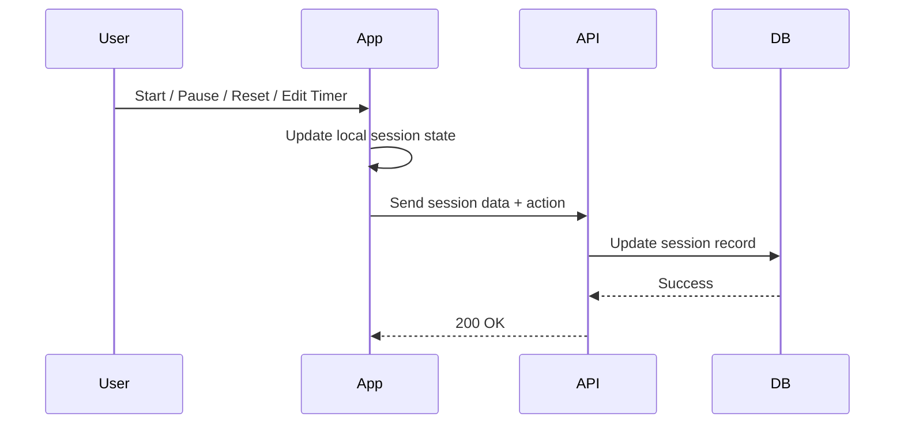
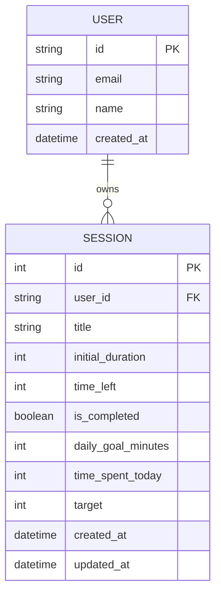
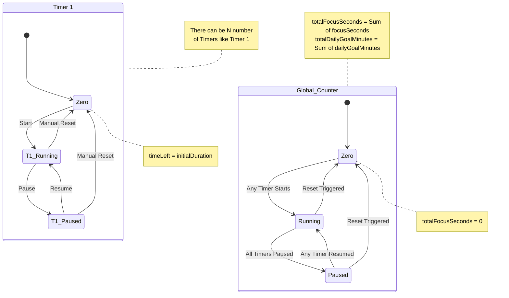
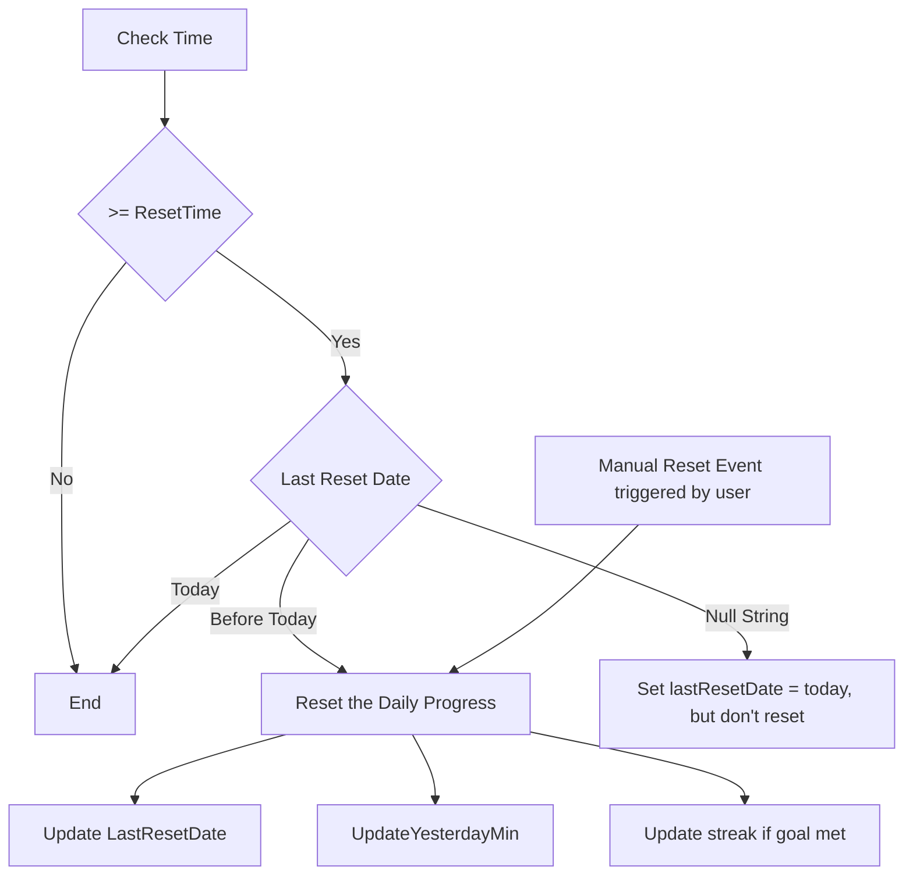

### Session
id: number
title: string
initialDuration: number
timeLeft: number
isCompleted: boolean
dailyGoalMinutes: number  // adjustable daily goal
timeSpentToday: number   // time spent on this task today
target: number // the target time at which this timer is supposed to complete









## Timers State Machine


### Reset State Machine


#### Timer states
##### Individual
* dailyGoalMinutes
* focusSeconds
* timeLeft
* initialDuration
* targetTime

##### Global
* yesterdayMinutes
* resetTime
* lastResetDate
* totalDailyGoalMinutes
* totalFocusSeconds

## State that needs to be stored in localStorage
- resetTime
- sessions
  - The state of each timer (running, stopped)

## Authentication

#### Authentication dependent features
- Data storage across devices for a user
- Analytics

```mermaid
flowchart TD

```